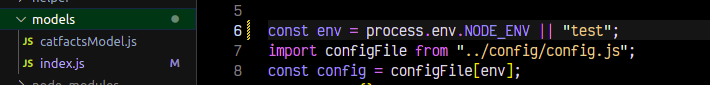

# Software-Engineer-Test 

## Overview:
1. This test is owned by Swirge and is solely used to facilitate Swirge interview process only. 
2. This test covers the basics of working with NodeJS working environment, which includes
    a) Basic git operations
    b) NodeJS environment setup
    d) CRUD with mysql DB
    d) Unit test with jest
3. This test is intented to solve real life scenario with open book concepts. 

## Features
1. Fetch list of 5 cat facts from public API and insert into a mysql database.
2. Fetch a single record of a cat fact.
3. Update cat fact.
4. Delete saved record of a cat fact.

## Prerequisite:
1. Have git, npm installed and running in local machine
2. Have mysql installed in local machine
3. Use node version > v14.17.2

## Tech Tools
<ul>
  <li><a href="https://nodejs.org/en/">Node js</a></li>
  <li><a href="https://expressjs.com/">Express js</a></li>
  <li><a href="https://developer.mozilla.org/en-US/docs/Web/JavaScript">JavaScript es6+</a></li>
  <li><a href="https://jestjs.io/">Jest</a></li>
  <li><a href="https://github.com/visionmedia/supertest">Supertest</a></li>
</ul>

## Api Endpoints
| Endpoints                           | Functionalities                             |
| ------------------------------------| ------------------------------------------- |
| POST _/api/v1/addcatfacts_          | fetches and insert records into DB          |
| GET _/api/v1/allcatfacts_           | get all cat records                         |
| GET _/api/v1/onecatfact/:id_        | gets a specific record                      |
| PUT _/api/v1/updatecatfact/:id_     | update a specific record                    |
| DELETE _/api/v1/deletecatfact/:id_  | delete a specific record                    |

## Get Started
**1. clone repo and cd into directory**
```
git clone _https://github.com/sirStephen/Swirge-assessment-test.git_
```

**2. install dependencies**
```
npm install
```

**3. start app**
```
npm run dev
```

**4. test**
- Before running test, navigate to folder /model/index.js
- replace delelopment to test as seen
```const env = process.env.NODE_ENV || "development";```


- run ```npm run dev```
- make a post request through route POST /api/v1/addcatfacts to fetch cat fact records from public API that will insert into the test database.
- run ```npm run test```

## Author
Gregory Otiono
<a href="https://github.com/sirStephen/Swirge-assessment-test">https://github.com/sirStephen/Swirge-assessment-test</a>